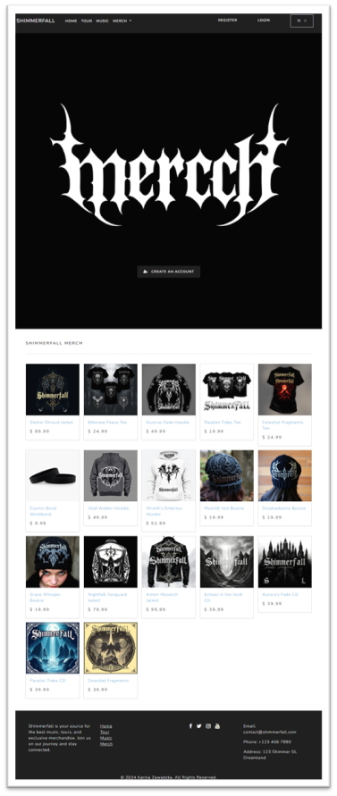
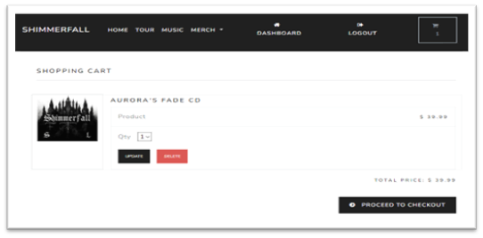
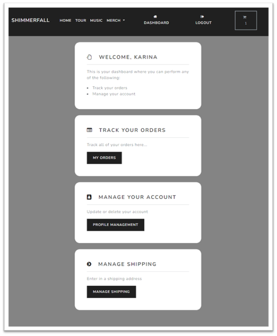
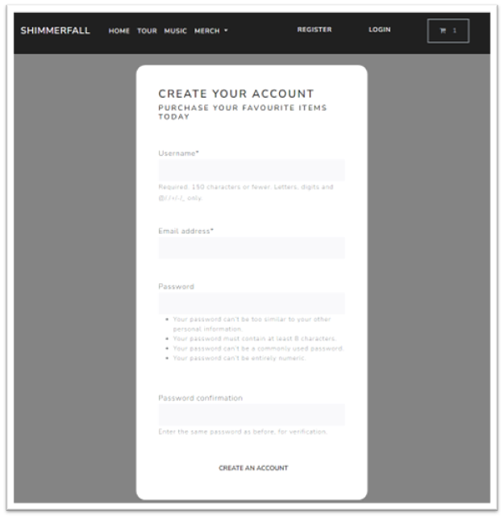

# 🎵 Shimmerfall – Fullstack Web App for a Music Band

**Shimmerfall** is a full-featured web application built entirely from scratch as a Fullstack Developer project.  
It is designed for a music band to manage and sell merchandise, albums, and other products online — with a complete order flow, user authentication, and PayPal integration.

---

## 🔧 Technologies Used

- **Backend**: Python, Django, Django ORM  
- **Database**: PostgreSQL  
- **Frontend**: HTML, CSS, JavaScript, Bootstrap  
- **Payment Integration**: PayPal REST API  
- **Additional Tools**:
  - `django-crispy-forms` – responsive and clean forms
  - `django-mathfilters` – math operations in templates

---

## ✨ Features

### 🛒 E-commerce & Order Handling
- Browse the product catalog (albums, t-shirts, gadgets, etc.)
- Add/remove/edit products in cart
- Quantity management and automatic total price calculation
- Order preview before payment (product breakdown, quantity, pricing)
- Order form and secure checkout using PayPal

### 📦 Product & Category Management
- Add/edit/delete products via admin panel
- Group products into categories
- Filter and display products by category

### 👤 User Accounts
- User registration, login, and logout
- User profile and order history

---

## 🗂 App Structure

The Django project consists of four modular apps:

| App Name     | Responsibility                                 |
|--------------|-------------------------------------------------|
| `store/`     | Product and category management                |
| `cart/`      | Shopping cart logic and session management     |
| `account/`   | User authentication and profile management     |
| `payment/`   | PayPal integration and order finalization      |

---

## 📸 Screenshots

| View                            | Screenshot Preview                   |
|---------------------------------|--------------------------------------|
| Merch / Product listing         |           |
| Cart with product               |   |
| User Profile (logged in)        |         |
| Registration Form               |    |


---

## 🚀 Getting Started

To run this project locally:

```bash
# Clone the repository
git clone https://github.com/karinazz/Shimmerfall.git
cd Shimmerfall

# Create and activate a virtual environment
python -m venv venv
source venv/bin/activate    # On Windows: venv\Scripts\activate

# Install dependencies
pip install -r requirements.txt

# Set up the database
python manage.py makemigrations
python manage.py migrate

# Create superuser (optional, for admin access)
python manage.py createsuperuser

# Run the server
python manage.py runserver
